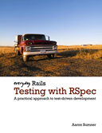

```
Roberto Nogueira  BSd EE, MSd CE
Solution Integrator Experienced - Certified by Ericsson
```

# Everyday Rails Testing with RSpec



## Contents

```
Table of Contents

Preface to this edition
Acknowledgements
1. Introduction
[x] Why RSpec?
[x] Who should read this book
[x] My testing philosophy
[x] How the book is organized
[x] Downloading the sample code
[x] Code conventions
[x] Discussion and errata
[x] A note about gem versions
[x] About the sample application
2. Setting up RSpec
[x] Gemfile
[x] Test database
[x] RSpec configuration
[x] Faster test suite start times with the rspec binstub
[x] Generators
[x] Summary
[x] Questions
[x] Exercises
3. Model specs
[x] Anatomy of a model spec
[x] Creating a model spec
[x] The new RSpec syntax
[x] Testing validations
[x] Testing instance methods
[x] Testing class methods and scopes
[x] Testing for failures
[x] More about matchers
[x] DRYer specs with describe, context, before and after
[x] Summary
[x] Question
[x] Exercises
4. Generating test data with factories
[x] Factories versus fixtures
[x] Installing Factory Girl
[x] Adding factories to the application
[x] Generating unique data with sequences
[x] Associations in factories
[ ] Avoiding duplication in factories
[ ] Callbacks
[ ] How to use factories safely
[ ] Summary
[ ] Exercises
5. Basic controller specs
[ ] Why test controllers?
[ ] Why not test controllers?
[ ] Controller testing basics
[ ] Organization
[ ] Setting up test data
[ ] Testing GET requests
[ ] Testing POST requests
[ ] Testing PATCH requests
[ ] Testing DELETE requests
[ ] Testing non-CRUD methods
[ ] Testing nested routes
[ ] Testing non-HTML controller output
[ ] Summary
[ ] Exercises
6. Advanced controller specs
[ ] Getting ready
[ ] Testing the admin and user roles
[ ] Testing the guest role
[ ] Summary
[ ] Exercise
7. Controller spec cleanup
[ ] Shared examples
[ ] Creating helper macros
[ ] Using custom RSpec matchers
[ ] Summary
[ ] Exercises
8. Feature specs
[ ] Why feature specs?
[ ] What about Cucumber?
[ ] Additional dependencies
[ ] A basic feature spec
[ ] From requests to features
[ ] Adding feature specs
[ ] Debugging feature specs
[ ] A little refactoring
[ ] Including JavaScript interactions
[ ] Capybara drivers
[ ] Waiting for JavaScript
[ ] Summary
[ ] Exercises
9. Speeding up specs
[ ] Optional, terse syntax
[ ] Mocks and stubs
[ ] Automation with Guard and Spring
[ ] Tags
[ ] Other speedy solutions
[ ] Summary
[ ] Exercises
10. Testing the rest
[ ] Testing email delivery
[ ] Testing file uploads
[ ] Testing the time
[ ] Testing web services
[ ] Testing your application’s API
[ ] Testing rake tasks
[ ] Summary
[ ] Exercises
11. Toward test-driven development
[ ] Defining a feature
[ ] From red to green
[ ] Cleaning up
[ ] Summary
[ ] Exercises
12. Parting advice
[ ] Practice testing the small things
[ ] Be aware of what you’re doing
[ ] Short spikes are OK
[ ] Write a little, test a little is also OK
[ ] Strive to write feature specs first
[ ] Make time for testing
[ ] Keep it simple
[ ] Don’t revert to old habits!
[ ] Use your tests to make your code better
[ ] Sell others on the benefits of automated testing
[ ] Keep practicing
[ ] Goodbye, for now
[ ] More testing resources for Rails
[ ] RSpec
[ ] Rails testing
[ ] About Everyday Rails
[ ] About the author
[ ] Colophon
[ ] Change log
```
